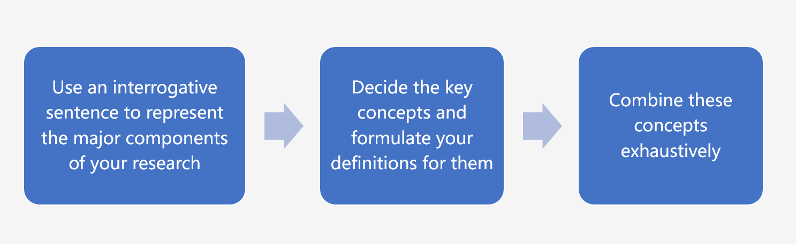
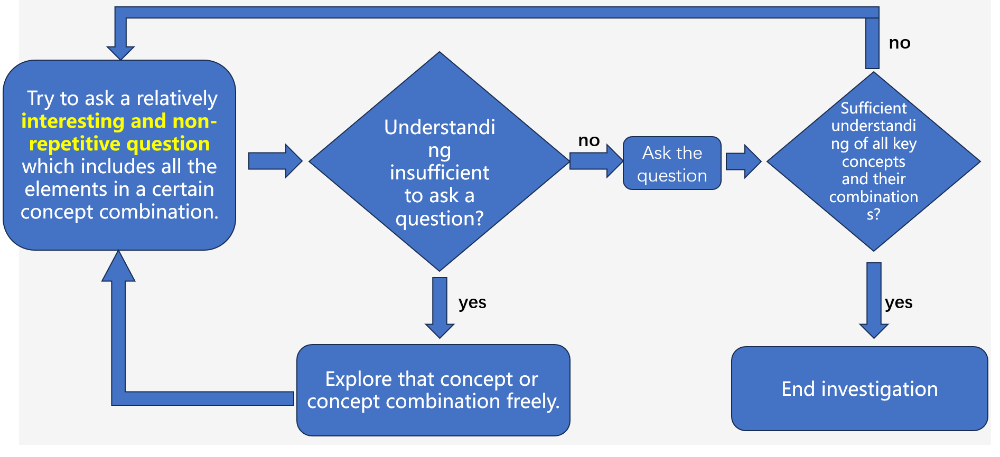
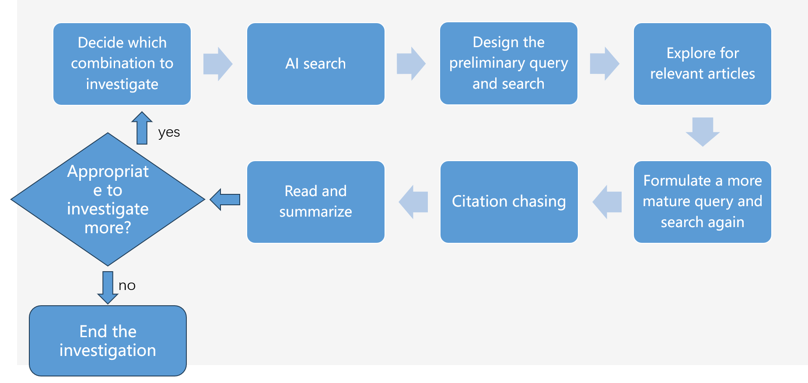
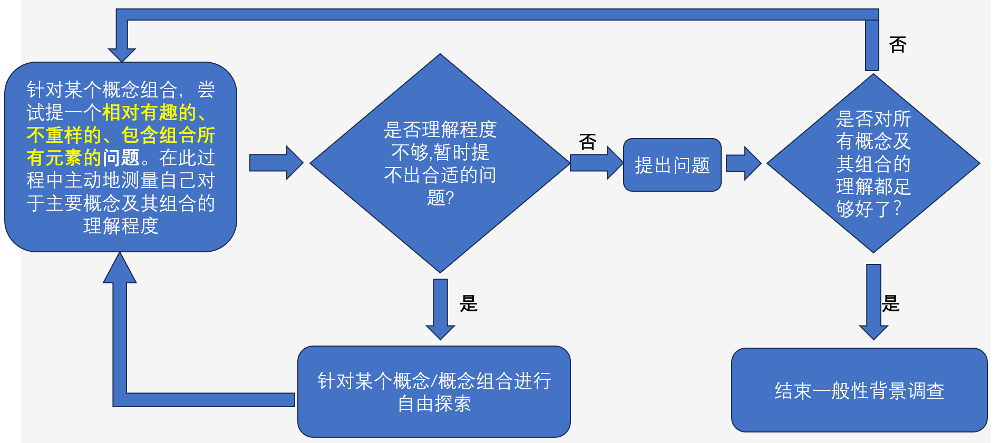
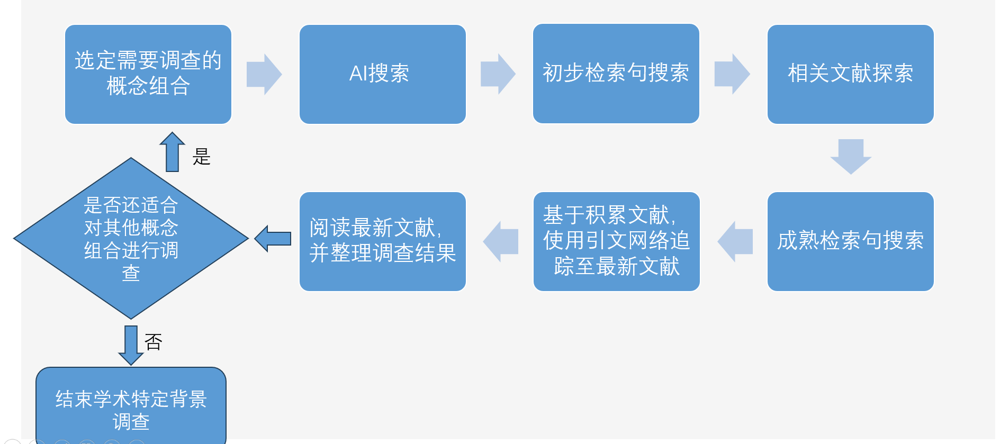

## **I-View-U is a systematic literature review workflow, which aims to (1) provide an environment where curiosity could efficiently thrive into accurate scientific questions; (2) systematically synthesize the literature evidence needed to answer the question**

**✨A recent live demo of I-View-U, check it out!(https://www.bilibili.com/video/BV1f7EMzmEFJ/)**

This workflow contains three stages: 
(1)Depict the Background Structure for the Research Question(DB)
(2)General Background Investigation(GB)
(3)Academic Background Investigation(AB)

The following are the inner workflows for each of the stages:
DB workflow

GB workflow

AB workflow

For more details of the I-View-U workflow, please refer to one of the following introductory videos:
https://bit.ly/3XUtT8B (English version); http://bit.ly/4i7moDC (Chinese version)

Examples are also available in the examples folder. 

The "the_combinator_for_major_concepts.py" can also be run at Google Colab:
https://colab.research.google.com/drive/19obLbeHC_Medq0IQn-rnqCk5Mwj5LYoV?usp=sharing

                                Have fun with the I-View-U workflow!

---

## **I-View-U 是一个系统文献综述工作流，其旨在：（1）为好奇心演化成精确的科学问题提供一个适合的环境；（2）系统地整合文献证据以回答问题**

**✨一个最近的I-View-U的现场演示视频，快来看看吧！(https://www.bilibili.com/video/BV1f7EMzmEFJ/)**

这个工作流可分成三个阶段：
（1）描绘研究问题的背景结构（Depict the Background Structure for the Research Question, DB）
（2）一般性背景调查(General Background Investigation, GB)
（3）学术特定背景调查(Academic Background Investigation, AB)

以下是各个阶段的内部工作流：

DB工作流:

GB工作流:

AB工作流:

请查看以下介绍视频以获取关于I-View-U的更多细节：
https://bit.ly/3XUtT8B (英文版); http://bit.ly/4i7moDC (中文版)

示例文件夹中也有具体例子

"the_combinator_for_major_concepts.py" Python代码可以在Google Colab运行:
https://colab.research.google.com/drive/19obLbeHC_Medq0IQn-rnqCk5Mwj5LYoV?usp=sharing

                                祝你I-View-U愉快！